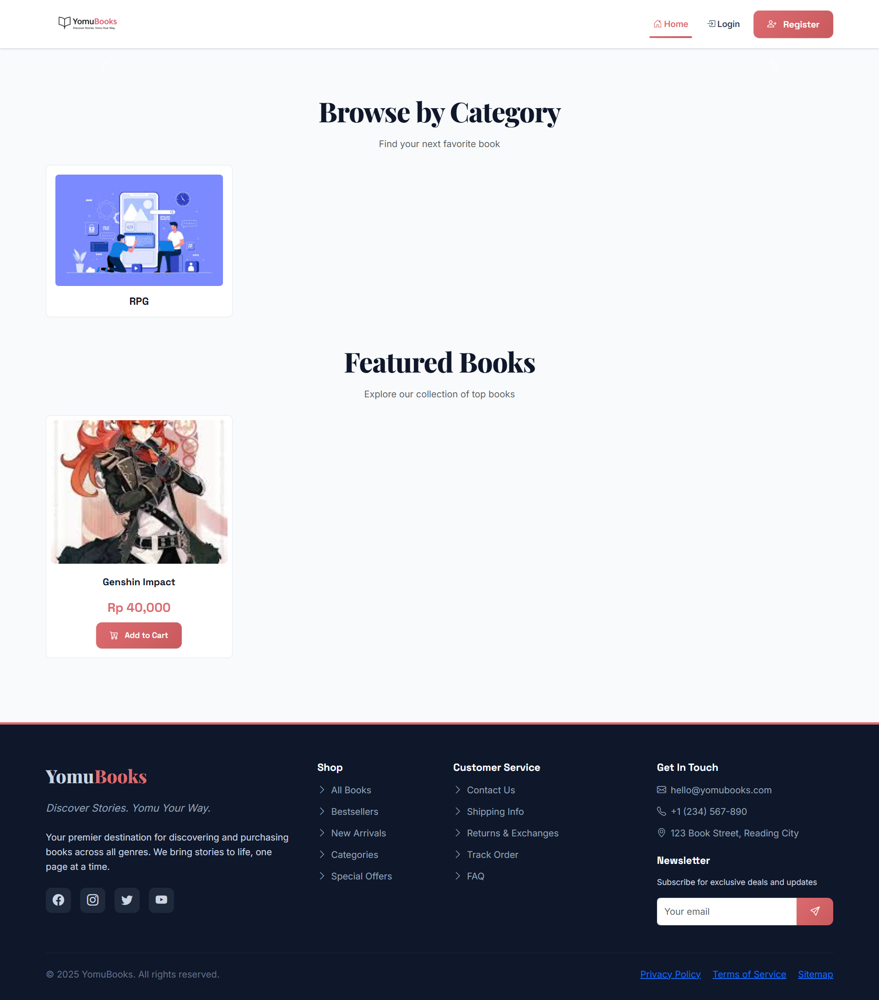
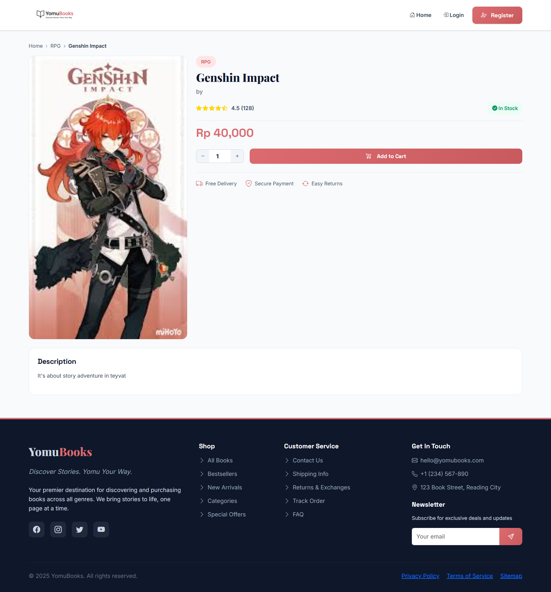
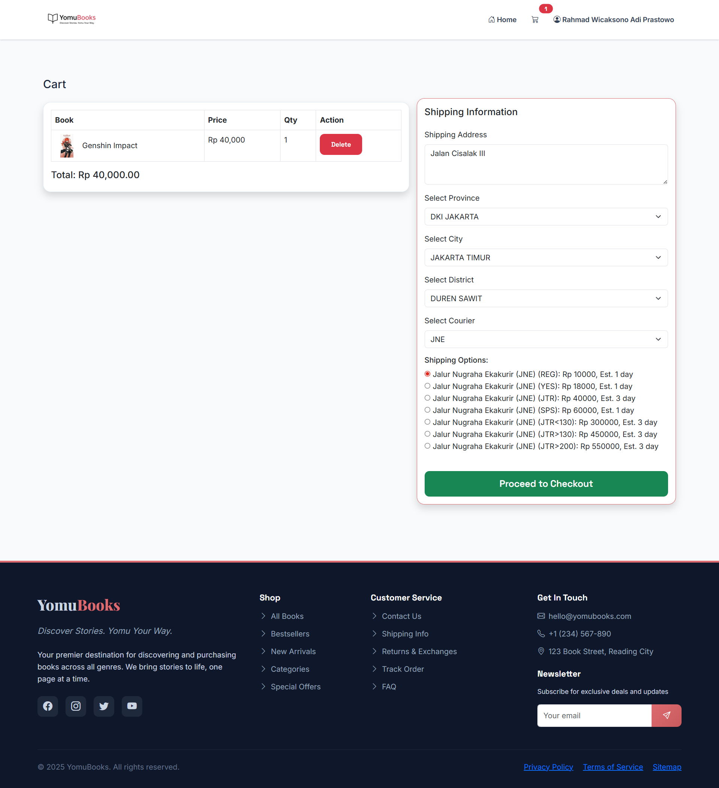
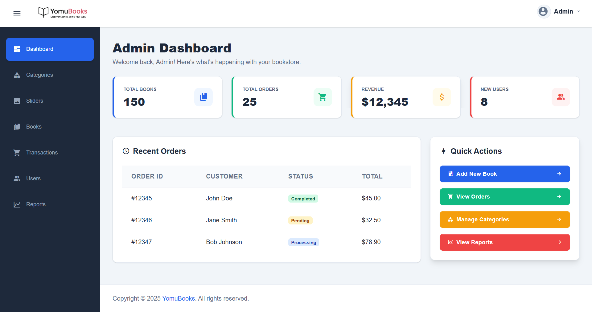

# YomuBooks - Discover Stories. Yomu Your Way.



[](https://laravel.com)
[](https://getbootstrap.com)
[](https://www.mysql.com/)
[](LICENSE)

**YomuBooks** is a modern, full-featured online bookstore application built with Laravel 11. It offers a premium user experience for browsing and purchasing books, complete with a robust admin panel for inventory and order management.

## 🚀 Features

### User Features
*   **Modern UI/UX**: Responsive design built with Bootstrap 5 and custom CSS for a premium feel.
*   **Book Discovery**: Browse books by category, search by title or author.
*   **Shopping Cart**: Seamless add-to-cart and checkout experience.
*   **Secure Payments**: Integrated with **Midtrans** for secure payment processing.
*   **User Accounts**: Registration, login, and order history tracking.

### Admin Features
*   **Dashboard**: Overview of sales, orders, and inventory.
*   **Book Management**: CRUD operations for books, including image uploads.
*   **Category Management**: Organize books into categories.
*   **Order Management**: View and update order statuses.
*   **User Management**: Manage customer accounts and permissions (via Spatie Permission).

## 🛠️ Tech Stack

*   **Backend**: Laravel 11 Framework
*   **Frontend**: Blade Templates, Bootstrap 5, Custom CSS
*   **Database**: MySQL
*   **Payment Gateway**: Midtrans
*   **Authentication**: Laravel Fortify / Sanctum
*   **Authorization**: Spatie Laravel Permission
*   **Assets**: Vite

## 📸 Screenshots

| Landing Page | Product Detail |
|:---:|:---:|
|  |  |

| Shopping Cart | Admin Dashboard |
|:---:|:---:|
|  |  |


## 📦 Installation

Follow these steps to set up the project locally:

1.  **Clone the repository**
    ```bash
    git clone https://github.com/yourusername/yomubooks.git
    cd yomubooks
    ```

2.  **Install PHP dependencies**
    ```bash
    composer install
    ```

3.  **Install NPM dependencies**
    ```bash
    npm install
    ```

4.  **Environment Setup**
    Copy the `.env.example` file to `.env` and configure your database and Midtrans credentials.
    ```bash
    cp .env.example .env
    ```

5.  **Generate Application Key**
    ```bash
    php artisan key:generate
    ```

6.  **Run Migrations & Seeders**
    ```bash
    php artisan migrate --seed
    ```

7.  **Build Assets**
    ```bash
    npm run build
    ```

8.  **Serve the Application**
    ```bash
    php artisan serve
    ```

    Visit `http://localhost:8000` in your browser.

## 📄 License

This project is licensed under the [MIT License](LICENSE).
